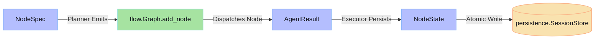
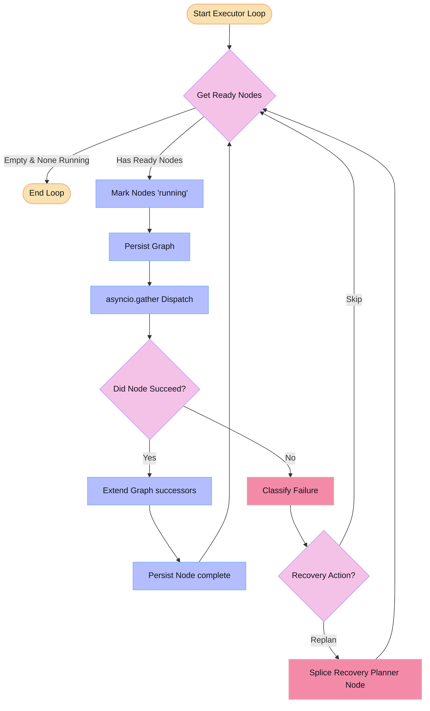
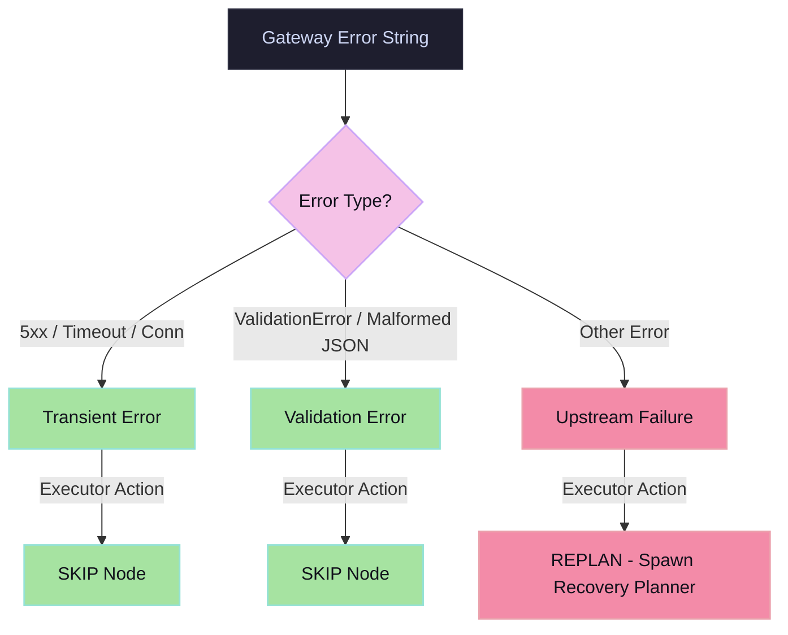

# Architecture Reference — Session 8 Multi-Agent DAG Orchestrator

> [!NOTE]
> Code-focused walkthrough. Every claim is backed by a file:line reference.
> Read alongside `code/flow.py` (300 lines — fits in your head).

---

## 📂 1. Directory File Map

Below is the visual map of the repository, highlighting where major agentic orchestration components reside:

```text
Root/
├── code/
│   ├── flow.py              ← THE entry point. Graph + Executor + CLI. Read this first.
│   ├── skills.py            ← Skill loading, prompt rendering, gateway dispatch.
│   ├── recovery.py          ← Failure classification + critic-fail splice.
│   ├── persistence.py       ← Atomic session writes (graph.json + per-node JSON).
│   ├── schemas.py           ← Pydantic contracts: AgentResult, NodeSpec, NodeState.
│   ├── sandbox.py           ← subprocess Python runner (usability boundary).
│   ├── mcp_runner.py        ← Multi-turn tool-use loop (tool-calling skills).
│   ├── agent_config.yaml    ← Skill catalogue — the ONLY file you edit to add a skill.
│   └── prompts/
│       ├── planner.md       ← Emits JSON DAG; the "program" the Executor runs.
│       ├── coder.md         ← STUB — your Part 4 work goes here.
│       ├── critic.md        ← Emits {"verdict":"pass"|"fail","rationale":"..."}.
│       └── ...              ← One markdown prompt per skill.
```

> [!TIP]
> **The Two-File Rule:** To add a new skill to the catalog, you only need to edit `agent_config.yaml` and create a prompt file under `prompts/<name>.md`. You do **not** need to touch any Python codebase file.

---

## 📐 2. The Three Core Types (`schemas.py`)

These three Pydantic models are the strict, type-safe boundaries between every orchestration layer:



### A. `NodeSpec` — Emitted by the Planner
*Represents one node the Planner intends the orchestrator to create.*
```python
class NodeSpec(BaseModel):
    skill: str              # matches a key in agent_config.yaml
    inputs: list[str]       # "USER_QUERY" | "n:<label>" | "art:<id>"
    metadata: dict          # Opaque bag — label, question, failure_report …
```

### B. `AgentResult` — Returned by Every Skill
*The boundary contract returned by `skills.run_skill`.*
```python
class AgentResult(BaseModel):
    success: bool
    agent_name: str
    output: dict            # skill-specific JSON payload
    successors: list[NodeSpec]  # dynamic children this skill wants added
    elapsed_s: float
    error: str | None
```

### C. `NodeState` — Persisted to Disk per Node
*Represents the full history and execution footprint of a single graph vertex.*
```python
class NodeState(BaseModel):
    node_id: str
    skill: str
    status: Literal["pending","running","complete","failed","skipped"]
    inputs: list[str]
    result: AgentResult | None
    prompt_sent: str | None   # exact bytes sent to gateway — load-bearing for replay
    started_at: float | None
    completed_at: float | None
```

---

## 🕸️ 3. The `Graph` Class (`flow.py:37–149`)

A thin wrapper around `networkx.DiGraph` representing the active execution DAG. Nodes are uniquely labeled string keys (`"n:1"`, `"n:2"`, …).

### 3.1 Node Creation (`Graph.add_node`, line 45)
Whenever a node is added, incoming edges are established automatically for any inputs referencing sibling nodes:
```python
def add_node(self, skill, inputs, metadata=None) -> str:
    self._counter += 1
    nid = f"n:{self._counter}"                      # monotone counter key
    self.g.add_node(nid, skill=skill, inputs=list(inputs),
                    metadata=dict(metadata or {}), status="pending")
    for inp in inputs:
        if inp.startswith("n:") and inp in self.g.nodes:
            self.g.add_edge(inp, nid)               # Directed Edge = Context dependency
    return nid
```

### 3.2 Finding Ready Nodes (`Graph.ready_nodes`, line 58)
Finds all nodes whose predecessors are either `complete` or `skipped`, enabling concurrent execution batches:
```python
def ready_nodes(self) -> list[str]:
    out = []
    for nid, d in self.g.nodes(data=True):
        if d["status"] != "pending":
            continue
        preds = list(self.g.predecessors(nid))
        # completed OR skipped predecessors unblock execution
        if all(self.g.nodes[p]["status"] in ("complete", "skipped") for p in preds):
            out.append(nid)
    return out
```

### 3.3 Growing the Graph (`Graph.extend_from`, lines 74–149)

Called by the Executor each time a node completes. It splices in new children in **three sequential steps, in this fixed order**, and returns the list of new node ids:

1. **Dynamic successors** (lines 86–131) — children the skill emitted at runtime (`result.successors`). Added in **two passes**: pass 1 creates each node bare and records its `metadata.label → assigned-id`; pass 2 resolves each child's `inputs`, translating `n:<label>` → assigned id, passing `n:<int>` / `USER_QUERY` / `art:` references through, and falling back to the parent for anything unknown. The label indirection lets the **Planner name nodes symbolically** without knowing the integer ids it will be handed.
2. **Static `internal_successors`** (lines 133–135) — YAML-driven, no runtime data. Every skill of this type gets its listed successors auto-appended off the parent (e.g. `coder → sandbox_executor`), with zero Planner/Executor code change.
3. **Critic auto-insertion** (lines 137–147) — only if the *source* skill is `critic: true`. For each child added in Steps 1–2, it interposes a Critic: cut the `src → child` edge, add a `critic` node fed by `src`, rewire `critic → child`. The child cannot become `ready` until the Critic passes.

```python
def extend_from(self, src_nid, result, *, registry) -> list[str]:
    added = []
    src_def = registry.get(self.g.nodes[src_nid]["skill"])
    # Step 1 — dynamic successors (two-pass: add bare, then resolve label refs)
    ...
    # Step 2 — static internal_successors
    for child_skill in src_def.internal_successors:
        added.append(self.add_node(child_skill, inputs=[src_nid]))
    # Step 3 — critic auto-insertion over a SNAPSHOT of Steps 1+2
    if src_def.critic and added:
        for child_nid in list(added):              # snapshot — no critic-on-critic
            self.g.remove_edge(src_nid, child_nid)
            critic_nid = self.add_node("critic", inputs=[src_nid],
                                       metadata={"target": src_nid, "child": child_nid})
            self.g.add_edge(critic_nid, child_nid)
            added.append(critic_nid)
    return added
```

**Why the order is load-bearing:** Step 3 iterates `list(added)` — a snapshot taken *before* any critics are appended — so it gates **every** child from Steps 1 and 2 (dynamic *and* static), and critics never receive critics of their own. Running critic-insertion between Steps 1 and 2 would let the `internal_successors` children slip through ungated; the ordering is what makes the Critic a *complete* gate. These are three of the **five growth actors** in the `flow.py` module docstring — the other two being the Planner's seed plan and `recovery.plan_recovery` re-invocation on node failure (§6).

---

## 🔄 4. The `Executor` Loop (`flow.py:154–291`)

The main runtime loop handles parallel node dispatching, state persistence boundaries, and dynamic graph growth.



### 4.1 Loop Guards
To prevent infinite execution loops (e.g., a looping Planner), two strict bounds are enforced:
1. `MAX_NODES = 60` (`flow.py:32`): A hard maximum cap on the graph's node count.
2. **Per-Target Cap:** The `recovered_branches` dictionary limits Critic-failed recovery planners to at most one re-plan per branch.

---

## 🛠️ 5. Skill Execution (`skills.py`)

### 5.1 The Catalogue (`SkillRegistry.__init__`, line 62)
There is **no Python class per skill**. The registry loads `agent_config.yaml` once and turns every top-level key into a `Skill` object, so registering a new agent behaviour is a YAML edit, not a code change:
```python
class SkillRegistry:
    def __init__(self):
        cfg = yaml.safe_load(AGENT_CONFIG_PATH.read_text())
        self._skills = {n: Skill(n, c) for n, c in cfg.items()}
```
Each `Skill` carries its prompt-file path, `tools_allowed`, `internal_successors`, `critic` flag, `provider_pin`, and per-skill `temperature` / `max_tokens` (line 38–53) — all read from the YAML, so tuning one skill never touches Python.

### 5.2 Input Resolution (`resolve_inputs`, line 77)
Before a node runs, its declared `inputs` list is materialised into concrete data. Four input forms are recognised, each producing a typed dict:

| Form | Resolved to | `kind` |
|---|---|---|
| `USER_QUERY` | the original query text | `query` |
| `n:<id>` | the **`AgentResult.output` of that completed upstream node** (read from the graph node's `result` attr) | `upstream` |
| `art:<sha>` | artifact bytes, utf-8 decoded, **truncated to 20 000 chars** | `artifact` |
| anything else | passed through verbatim | `literal` |

This is the heart of **token scoping**: a node receives *only its declared upstream outputs*, not the whole run history.

### 5.3 Prompt Rendering (`render_prompt`, line 146) — the 5-section prompt
The rendered prompt is assembled from up to five sections, in fixed order:
1. **System** — `skill.prompt_template()` (the skill's `.md` file)
2. **`USER_QUERY:`** — the original query, always present
3. **`FAILURE:`** — the failure report, only on a recovery/critic re-run
4. **`MEMORY HITS:`** — FAISS-ranked `MemoryItem`s, capped at **8 hits** with a **400-char chunk preview** each (`_format_memory_hits`, line 113)
5. **`INPUTS:`** — `json.dumps(resolved, ...)`, **truncated to 20 000 chars** (line 158)

### 5.4 Dispatch (`run_skill`, line 230) — two paths
`run_skill` resolves inputs, renders the prompt, then branches on `skill.name`:

**Path A — `sandbox_executor` (no LLM call).** Picks the `code` field out of its upstream coder's `output` dict and runs `sandbox.run_python` directly — bypassing the gateway entirely:
```python
if skill.name == "sandbox_executor":
    code = ""
    for r in resolved:
        if r.get("kind") == "upstream" and isinstance(r.get("output"), dict):
            code = r["output"].get("code") or code
    if not code:
        return AgentResult(success=False, error="no code in upstream coder output")
    out = run_python(code)                       # sandbox.py subprocess
    return AgentResult(success=(out["exit_code"] == 0 and not out["timed_out"]), output=out)
```

**Path B — all other skills (LLM via V8 gateway, `agent=<skill_name>`).** Splits again on whether the skill has tools:
- **Tools present** → `mcp_runner.run_with_tools` runs a **multi-turn tool loop**: opens one MCP stdio session, dispatches each `tool_call` the model emits, feeds results back until the model returns final text.
- **No tools** → a **single-turn** `LLM().chat` call (run via `asyncio.to_thread` so concurrent nodes don't block the event loop).

Both paths pin `temperature` / `max_tokens` / `provider` from the skill's YAML, so routing (`agent_routing.yaml`) and cost-by-agent attribution work per skill.

### 5.5 Reply Parsing (`parse_skill_json`, line 162)
Skills must return a single top-level JSON object. The parser strips markdown fences the model may add despite instructions, then falls back to slicing from the first `{` to the last `}` if a direct `json.loads` fails — returning `{}` rather than throwing. `run_skill` then lifts orchestrator-recognised fields (`successors`, and `nodes` for the Planner) out, validating each as a `NodeSpec`; **malformed specs fail the node loudly** rather than being silently dropped (P0 #1 fix, line 298–329).

### 5.6 Why token counts stay bounded per node (issue #18 "Done when")
The **`INPUTS` block contains only the resolved outputs of a node's *declared* upstream parents** — each `n:<id>` becomes that one parent's `AgentResult.output`, never the cumulative conversation. Three hard caps keep any single node's prompt bounded regardless of how large the graph grows:

- **Edge-scoped inputs** — a node sees its parents' outputs only (§5.2), not the whole run. A 40-node graph still feeds a leaf node just its 1–3 parents.
- **20 000-char truncation** on both the `INPUTS` JSON and each `art:` blob (lines 105, 158).
- **Memory capped** at 8 hits × 400-char previews (§5.3).

This is the structural win over Session 7's sequential loop, where history grew cumulatively into every step. In S8 the per-node prompt size is a function of a node's **fan-in**, not the run's **length** — which is what produced the measured ~3× input-token reduction (54k → 17k) in §3's worked example.

---

## 🚨 6. Failure & Recovery (`recovery.py`)

### 6.1 Failure Classification (`classify_failure`)
Classifies gateway error payloads into three categories, deciding whether to retry, skip, or trigger recovery:



### 6.2 Critic Verdict Splicing (`handle_critic_verdict`)
Spliced automatically on edges of nodes with `critic: true` in YAML.


When a Critic node returns a `fail` verdict:
1. The target child is marked `skipped` to bypass the broken branch.
2. A new Planner node is dynamically queued, injected with the failure rationale.
3. The branch is re-planned (limited by a strict per-target recovery cap of 1).

---

## 💾 7. Persistence Layer (`persistence.py`)

### 7.1 Atomic Write Pattern
To protect session records from data corruption if the system process is terminated mid-write, a strict **atomic swap** pattern is implemented:
```python
tmp = path.with_suffix(".tmp")
tmp.write_text(json.dumps(data))
os.replace(tmp, path)              # POSIX-compliant atomic file system swap
```

### 7.2 Resume Safety
Upon resuming an interrupted session via `flow.py --resume <sid>`, any node that was left in the `running` state at crash time is reset to `pending` and re-executed cleanly from its boundary.

---

## 📦 8. Coder → SandboxExecutor Chain

The static execution chain is automatically declared using `internal_successors` in the skill YAML catalog:


1. **Coder** emits a JSON payload matching the contract: `{"code": "<python source>", "rationale": "..."}`.
2. **`internal_successors`** appends `sandbox_executor` automatically.
3. **`sandbox_executor`** runs the Python script in a throwaway directory with a **30-second timeout**, a **1 MB output cap**, and an **environment whitelist** (`PATH`, `HOME`, `LANG`, `LC_ALL`, `LC_CTYPE`) to scrub API keys and keep execution isolated.
