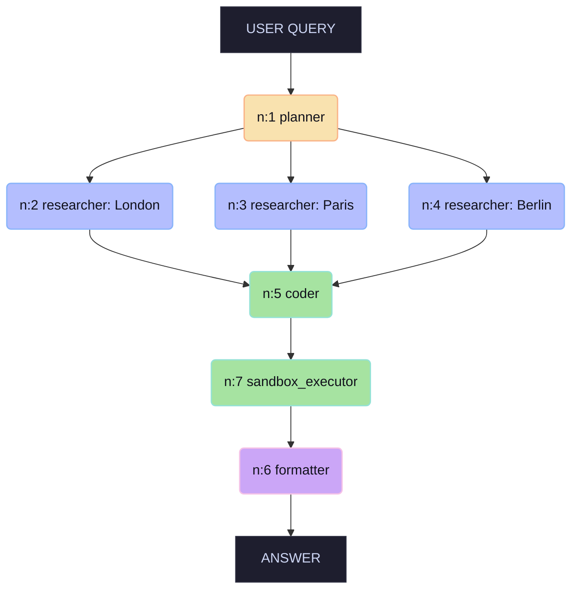

# Class Notes — Session 8: Multi-Agent DAG Orchestration

> Running notes for quick reference. **Key Notes** below are the cheat-sheet; click a topic to jump to the detail.

---

## 🔑 Key Notes (TL;DR)

* **DAG (Directed Acyclic Graph):** Replacing Session 7's sequential agent loop, the Planner builds a graph; the Executor runs every node whose predecessors are complete or skipped. [details](#dag-directed-acyclic-graph)
* **The "Linux of Graph Systems":** Built on **NetworkX** `DiGraph`, allowing complex graph algorithms, node-level states, and self-correcting mechanisms. [details](#state--execution)
* **Meta/Facebook Research Support:** Aligns with the latest paper (May 18, 2026) endorsing "code as an agent harness" as the premier strategy in agentic system design.
* **Skills Standard:** A skill is a **prompt + MCP tools + temperature** (a triple) registered via YAML. It separates concerns, optimizes context windows, and enables specialized Small Language Models (SLMs) to beat expensive generalists. [details](#skills)
* **Critic Loop:** Spliced automatically or planner-emitted to verify strict structural constraints. verdict=fail blocks children, triggers a single recovery planner re-plan. [details](#critic-loop)
* **Sandbox Environment:** Isolated `subprocess.run` execution under 30s timeout and 1MB output caps. whitelists env variables (`PATH`, `HOME`, `LANG`, `LC_ALL`, `LC_CTYPE`) to prevent API secrets (e.g. `OPENAI_API_KEY`) from leaking. [details](#sandbox-environment)
* **Cost Tracking:** Session 8 adds cost tracking (`/v1/cost/by_agent`), providing complete enterprise-grade token cost visibility.

---

## What Session 8 Adds Over Session 7

Per `docs/Session8_MultiAgent_DAG_Orchestration.md` ("What this session adds"), S8 adds six changes over S7, each in its own module, while leaving the S7 code byte-identical:

1. **The Orchestrator** — new `flow.py`: a `Graph` wrapper over a NetworkX `DiGraph` plus an `Executor` that walks the graph, running each node once its predecessors complete (independent nodes run concurrently) and returns the terminal Formatter's answer.
2. **The Skill Catalogue** — new `agent_config.yaml` enumerating the skills (planner, researcher, retriever, distiller, summariser, critic, formatter, coder, sandbox_executor, browser), each with prompt file, allowed tools, temperature, and max-tokens. One yaml-parameterised `Skill` class in `skills.py` instead of a class per skill.
3. **The Planner** — `prompts/planner.md`: prompts the model to emit the next set of nodes as JSON (rationale + node list); the Executor reads it and extends the graph.
4. **The Critic** — distiller is marked `critic: true`; a critic node is inserted on every outgoing edge. On fail, the blocked child is skipped and one Planner recovery node is queued, with a per-target cap to prevent fail loops.
5. **The Persistence Layer** — `SessionStore` in `persistence.py`: writes `graph.json` (via `nx.node_link_data`) and one `NodeState` JSON per node, all atomic writes, with resume support.
6. **The Gateway (V8)** — new gateway on port 8108 adding agent/session log columns, a `/v1/chat/batch` endpoint, a `/v1/cost/by_agent` endpoint, retry-on-5xx, and `agent_routing.yaml` for pinning agents to providers. V7 stays untouched on 8107.

---

## DAG (Directed Acyclic Graph)

### What the letters mean
* **D — Directed:** every edge points one way (node A → node B), indicating a flow / dependency.
* **A — Acyclic:** **no directed cycles** — starting at any node and following the edges, you can never return to it.
* **G — Graph:** nodes connected by edges.

> **Formal definition** ([Wikipedia](https://en.wikipedia.org/wiki/Directed_acyclic_graph)): a directed graph with no directed cycles. Key theorem: **DAGs are exactly the directed graphs that have a topological ordering** — a linear order where every edge u→v has u before v. This is what makes dependency-driven execution possible.

### Project Nuance: DiGraph with Self-Loops
The code utilizes a NetworkX **DiGraph** (Directed Graph). While a pure DAG does not permit loops, a DiGraph allows a node to call itself for recovery, critic-retries, or self-correction, enabling localized loops without polluting the entire orchestrator flow.


### Why a graph instead of a sequential loop

| Sequential (Session 7) | Graph / DAG (Session 8) |
|---|---|
| One step at a time (Serial) | Independent nodes run **in parallel** |
| Context bloat: History grows cumulative | Scoped context: Each node gets only its immediate parents' output |
| A failure means re-run from scratch | Re-run **only the failed sub-graph** |
| Rigid, hard to tweak individual steps | Change one node's prompt/LLM/temperature, replay the rest |

### Core Properties
* **Nodes = Units of Work:** represents an agent/skill (researcher, coder, critic, formatter…).
* **Edges = Context Flow & Dependencies:** Edges carry the context. If N5 has inputs from N2 and N3, its system prompt is injected only with N2 and N3's outputs.
* **Concurrent Concurrency:** Nodes with no shared dependencies execute concurrently (via `asyncio.gather`). Concurrency cost equals the **slowest branch, not the sum**.

### How the graph grows — `Graph.extend_from` (the 3-step splice)

The graph is not static. Every time a node completes, the Executor calls `graph.extend_from(nid, result, registry=...)` (`code/flow.py:74–149`), which splices in new children in **three sequential steps, in this fixed order**:

1. **Dynamic successors** (`flow.py:86–131`) — children the skill itself emitted at runtime (`result.successors`). Added in **two passes**: pass 1 creates each node bare and records its `metadata.label → assigned-id`; pass 2 resolves every child's `inputs`, translating symbolic refs (`n:<label>` → assigned id, `n:<int>` pass-through, `USER_QUERY`/`art:` literals, unknown → fall back to the parent). The label indirection lets the **Planner name nodes symbolically** without knowing the integer ids the orchestrator will hand out.
2. **Static `internal_successors`** (`flow.py:133–135`) — YAML-driven, no runtime data. Every skill of this type gets its listed successors auto-appended off the parent. This is how a `coder` auto-grows a `sandbox_executor` (`internal_successors: [sandbox_executor]`) with **zero Planner or Executor code change**.
3. **Critic auto-insertion** (`flow.py:137–147`) — only if the *source* skill is `critic: true` (e.g. `distiller`). For each child added in Steps 1–2 it **interposes a critic**: cut the `src → child` edge, add a `critic` node fed by `src`, rewire `critic → child`. The child can't become `ready` until the critic passes.

**Why the order is load-bearing:** Step 3 iterates a **snapshot** (`list(added)`) of the children produced by Steps 1+2, taken *before* it appends any critics. So critics gate **every** newly-added child (dynamic *and* static), and critics never get critics of their own. If critic-insertion ran between Steps 1 and 2, the `internal_successors` children would slip through ungated — the ordering is what makes the critic a *complete* gate.

> These are three of the **five growth actors** named in the `flow.py` module docstring; the other two are the Planner's seed plan and `recovery.plan_recovery` re-invocation on node failure.

---

## The Classic Example

> **Query:** "Find the populations of London, Paris, and Berlin and tell me which two are closest in size."


```text
USER QUERY → n:1 planner
          → n:2/3/4 researcher (London | Paris | Berlin)  ← run in PARALLEL
          → n:5 coder
          → n:7 sandbox_executor
          → n:6 formatter
          → ANSWER
```



### Metrics Comparison (Session 7 vs Session 8)

*Illustrative figures for the full 7-node example above (planner → 3 researchers → coder → sandbox → formatter):*

| Metric | Session 7 (Sequential) | Session 8 (DAG) |
|---|---|---|
| Iterations / Nodes | 11 iterations | 7 nodes |
| Wall-Clock Time | 125 s | **62 s** (≈2× speedup) |
| Gateway Calls | 60 | 15 |
| Input Tokens | 54,000 | **17,000** (Token Scoping Win) |

### Measured Trace (`s8-21f781b2`)

The recorded run used the query *"Compare the populations of London, Paris, and Berlin"* — with no "which two are closest" clause, so the planner produced a simpler **5-node** graph (no coder/sandbox): `planner → 3 researchers (parallel) → formatter`. Per-skill `elapsed_s` from the trace:

| Node | Skill | elapsed | runs as |
|---|---|---:|---|
| n:1 | planner | 2.70 s | serial (head) |
| n:2 | researcher (London) | 49.33 s | **parallel** |
| n:3 | researcher (Paris) | 52.77 s | **parallel** ← slowest branch |
| n:4 | researcher (Berlin) | 41.11 s | **parallel** |
| n:5 | formatter | 9.82 s | serial (tail) |

* **Serial wall-clock** (sum of all nodes) = **155.73 s**
* **Parallel wall-clock** (critical path = planner + slowest researcher + formatter) = 2.70 + 52.77 + 9.82 = **65.29 s**
* **Speedup = 155.73 / 65.29 ≈ 2.39×**

* **The asyncio.gather Barrier:** All three researcher nodes start concurrently; the formatter waits on the slowest (52.77 s), not the 143.21 s sum. Speedup is bounded by the serial bottlenecks (planner head + formatter tail = 12.52 s).
* **Token Savings:** Derived from the **trace shape** where history is not carried forward.

---

## Skills

### What a skill is
A **skill = prompt + MCP tools + temperature** (a triple). Instead of one mega-agent trying to learn everything, the architecture separates concerns into lightweight, task-specific expert agents.

> **The Trinity Analogy:** Like Trinity downloading the helicopter piloting skill in *The Matrix*, an agent instantly assumes a specific capability by loading a skill prompt and its associated tools.


### Real-World Specialized Skills
* **LaTeX Compiling:** A specialized skill compiling complex layout, bibliography, and fonts (similar to building Linux kernels).
* **GST Tax Filing:** A local compliance skill aware of changing regional regulations and tax policies.
* **Language Localization:** Expert skills handling Indic font rendering, typography, and regional dialects.

### Skill Catalogue (`agent_config.yaml`)
Skills are fully registered via YAML, requiring **zero Python modifications** to register new agent behaviors.

```yaml
researcher:
  prompt: prompts/researcher.md
  tools_allowed: [web_search, fetch_url]
  temperature: 0.7          # exploratory search
  max_tokens: 2500

critic:
  prompt: prompts/critic.md
  temperature: 0.0          # deterministic verdict

coder:                      # Student Assignment
  prompt: prompts/coder.md
  internal_successors: [sandbox_executor]
  temperature: 0.2
```

---

## Critic Loop

### What it is
An LLM running at temperature `0.0` that acts as a quality gate. It reads an upstream node's output, checks it against the initial constraints (e.g. Syllable count, JSON schema, currency formatting), and emits a binary `pass` or `fail` verdict with a short rationale.


### The Loop & Splicing
* **Verdict = PASS:** Flow continues uninterrupted.
* **Verdict = FAIL:** 
  1. The blocked child node is marked `skipped` to avoid stalling downstream branches.
  2. A new **Planner Recovery Node** is dynamically spliced into the graph, carrying the critic failure rationale.
  3. The branch is re-planned.
* **Safety Boundary:** Bounded by a strict **per-target cap of 1 re-plan** per branch to prevent infinite recovery loops.

### The Rubber-Stamp Finding

**Forcing query:** *"Write a haiku about quantum entanglement. The haiku MUST be exactly 4-6-4 syllables (not the traditional 5-7-5) — count them."*

Across **three runs**, the Coder emitted a normal **5-7-5** haiku and the Critic returned **`pass`** every time, with the rationale *"follows the specified 4-6-4 syllable structure."* The wrong output was waved through three times in a row.

**Why it happened:** the Critic (`prompts/critic.md`) makes **no tool calls** — it is a pure-text LLM judge. When asked to "count syllables," the model doesn't count anything; LLMs operate on tokens, not phonemes. It **pattern-matched the keyword "4-6-4"** from the spec, saw a plausible-looking haiku, and approved. At `temperature 0.0` it does this *identically every time* — hence three identical false passes.

**The key separation — mechanism vs. policy:**

| | Wiring (mechanism) | Verdict quality (policy) |
|---|---|---|
| Question | Is the Critic node spliced, caps firing, recovery triggered? | Is the verdict actually *correct*? |
| Status | **Correct & unit-tested** | **Broken** — rubber stamp |
| Fixed by | The **orchestrator** | The Critic's **prompt** or a **tool** |

> The wiring is mechanism; the verdict quality is policy. They are separate problems, fixed in separate places. Conflating them produces a debugging session that touches the wrong code.

**Two clean fixes:**
1. **Give the Critic a real tool** — e.g. a syllable-counting function in the MCP server, added to the Critic's `tools_allowed`, so the verdict is grounded in an actual count.
2. **Only gate on LLM-verifiable properties** — LLM-as-judge is reliable for fluency, tone, and structural completeness, but unreliable for precise counting (syllables, characters, exact arithmetic, regex). Prefer constraints the model can actually check: "valid JSON," "≤ 280 characters," "mentions all three cities."

---

## Sandbox Environment

### What it is
A clean, secure wrapper around `subprocess.run` (`code/sandbox.py`) that runs code produced by the **Coder** node in an isolated child process, returning `stdout`, `stderr`, `exit_code`, and a list of generated files.


### Security: Environment Scrubbing
To prevent the sandboxed script from stealing sensitive environment secrets (like `OPENAI_API_KEY` or database credentials), the environment is scrubbed. Only a whitelisted subset is passed to the subprocess:

```python
DEFAULT_ENV_WHITELIST = ("PATH", "HOME", "LANG", "LC_ALL", "LC_CTYPE")
scrubbed_env = {k: os.environ[k] for k in DEFAULT_ENV_WHITELIST if k in os.environ}
```

* **PATH:** Locates the python interpreter.
* **HOME:** Allows libraries to resolve home directories.
* **LANG / LC_ALL / LC_CTYPE:** Retains encoding context (UTF-8) to prevent crash loops.

### Strict Execution Constraints
* **Timeout Cap:** Process is forcibly killed after **30 seconds** (`timed_out=True`).
* **Output Cap:** `stdout` and `stderr` are truncated at **1 MB** to prevent token poisoning from verbose prints.
* **Usability Boundary:** Designed as a safety boundary for accidental loops or leaked secrets, not a hard jail. Real security requires virtualization (Firejail/Docker).

---

## Other Session 8 Mechanisms

* **Cost Tracking:** Tokens and execution costs are tracked at the agent level (`/v1/cost/by_agent`), providing full visibility on cost efficiency.
* **Atomic Writes:** All graph and node states are written to temporary files first (`.tmp`) and then swapped atomically using `os.replace` to guarantee resume-safety on system crash/kill.
* **Gateway V8 Improvements:** Sits on port 8108, supporting batch routing, parallel worker dispatch, and direct provider pinning (saving 200-400ms routing latency).
