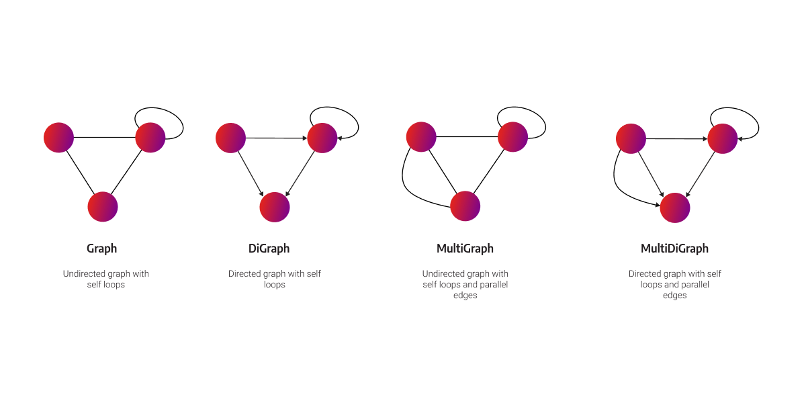
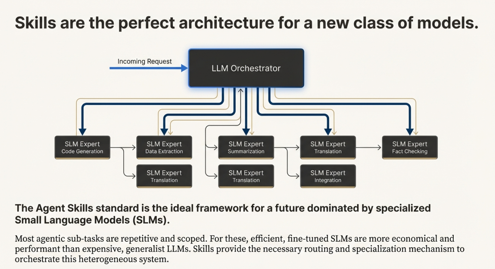
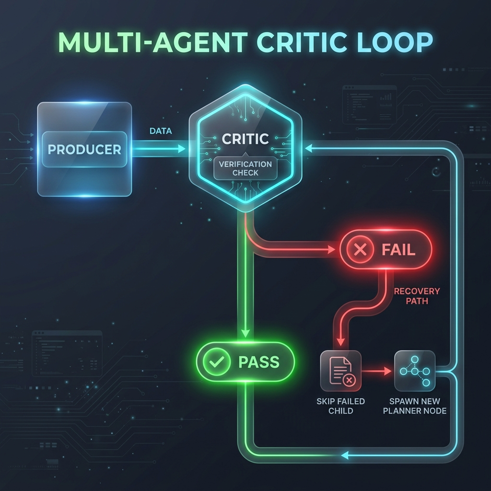
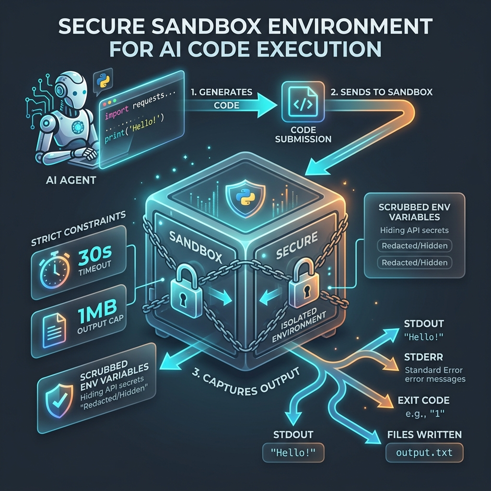

# Class Notes — Session 8: Multi-Agent DAG Orchestration

> Running notes for quick reference. **Key Notes** below are the cheat-sheet; click a topic to jump to the detail.

---

## 🔑 Key Notes (TL;DR)

* **DAG (Directed Acyclic Graph):** Replacing Session 7's sequential agent loop, the Planner builds a graph; the Executor runs every node whose predecessors are complete or skipped. [details](#dag-directed-acyclic-graph)
* **The "Linux of Graph Systems":** Built on **NetworkX** `DiGraph`, allowing complex graph algorithms, node-level states, and self-correcting mechanisms. [details](#state--execution)
* **Meta/Facebook Research Support:** Aligns with the latest paper (May 18, 2026) endorsing "code as an agent harness" as the premier strategy in agentic system design.
* **Skills Standard:** A skill is a **prompt + MCP tools + temperature** (a triple) registered via YAML. It separates concerns, optimizes context windows, and enables specialized Small Language Models (SLMs) to beat expensive generalists. [details](#skills)
* **Critic Loop:** Spliced automatically or planner-emitted to verify strict structural constraints. verdict=fail blocks children, triggers a single recovery planner re-plan. [details](#critic-loop)
* **Sandbox Environment:** Isolated `subprocess.run` execution under 30s timeout and 1MB output caps. whitelists env variables (`PATH`, `HOME`, `LANG`, `LC_ALL`, `LC_CTYPE`) to prevent API secrets (e.g. `OPENAI_API_KEY`) from leaking. [details](#sandbox-environment)
* **Cost Tracking:** Session 8 adds cost tracking (`/v1/cost/by_agent`), providing complete enterprise-grade token cost visibility.

---

## DAG (Directed Acyclic Graph)

### What the letters mean
* **D — Directed:** every edge points one way (node A → node B), indicating a flow / dependency.
* **A — Acyclic:** **no directed cycles** — starting at any node and following the edges, you can never return to it.
* **G — Graph:** nodes connected by edges.

> **Formal definition** ([Wikipedia](https://en.wikipedia.org/wiki/Directed_acyclic_graph)): a directed graph with no directed cycles. Key theorem: **DAGs are exactly the directed graphs that have a topological ordering** — a linear order where every edge u→v has u before v. This is what makes dependency-driven execution possible.

### Project Nuance: DiGraph with Self-Loops
The code utilizes a NetworkX **DiGraph** (Directed Graph). While a pure DAG does not permit loops, a DiGraph allows a node to call itself for recovery, critic-retries, or self-correction, enabling localized loops without polluting the entire orchestrator flow.



### Why a graph instead of a sequential loop

| Sequential (Session 7) | Graph / DAG (Session 8) |
|---|---|
| One step at a time (Serial) | Independent nodes run **in parallel** |
| Context bloat: History grows cumulative | Scoped context: Each node gets only its immediate parents' output |
| A failure means re-run from scratch | Re-run **only the failed sub-graph** |
| Rigid, hard to tweak individual steps | Change one node's prompt/LLM/temperature, replay the rest |

### Core Properties
* **Nodes = Units of Work:** represents an agent/skill (researcher, coder, critic, formatter…).
* **Edges = Context Flow & Dependencies:** Edges carry the context. If N5 has inputs from N2 and N3, its system prompt is injected only with N2 and N3's outputs.
* **Concurrent Concurrency:** Nodes with no shared dependencies execute concurrently (via `asyncio.gather`). Concurrency cost equals the **slowest branch, not the sum**.

---

## The Classic Example

> **Query:** "Find the populations of London, Paris, and Berlin and tell me which two are closest in size."


```text
USER QUERY → n:1 planner
          → n:2/3/4 researcher (London | Paris | Berlin)  ← run in PARALLEL
          → n:5 coder
          → n:7 sandbox_executor
          → n:6 formatter
          → ANSWER
```

### Metrics Comparison (Session 7 vs Session 8)

| Metric | Session 7 (Sequential) | Session 8 (DAG) |
|---|---|---|
| Iterations / Nodes | 11 iterations | 7 nodes |
| Wall-Clock Time | 125 s | **62 s** (2.11× speedup) |
| Gateway Calls | 60 | 15 |
| Input Tokens | 54,000 | **17,000** (Token Scoping Win) |

* **The asyncio.gather Barrier:** All three researcher nodes start concurrently and finish at the same instant (42.69s). Speedup is bounded by serial bottlenecks (Planner + Coder + Formatter).
* **Token Savings:** Derived from the **trace shape** where history is not carried forward.

---

## Skills

### What a skill is
A **skill = prompt + MCP tools + temperature** (a triple). Instead of one mega-agent trying to learn everything, the architecture separates concerns into lightweight, task-specific expert agents.

> **The Trinity Analogy:** Like Trinity downloading the helicopter piloting skill in *The Matrix*, an agent instantly assumes a specific capability by loading a skill prompt and its associated tools.



### Real-World Specialized Skills
* **LaTeX Compiling:** A specialized skill compiling complex layout, bibliography, and fonts (similar to building Linux kernels).
* **GST Tax Filing:** A local compliance skill aware of changing regional regulations and tax policies.
* **Language Localization:** Expert skills handling Indic font rendering, typography, and regional dialects.

### Skill Catalogue (`agent_config.yaml`)
Skills are fully registered via YAML, requiring **zero Python modifications** to register new agent behaviors.

```yaml
researcher:
  prompt: prompts/researcher.md
  tools_allowed: [web_search, fetch_url]
  temperature: 0.7          # exploratory search
  max_tokens: 2500

critic:
  prompt: prompts/critic.md
  temperature: 0.0          # deterministic verdict

coder:                      # Student Assignment
  prompt: prompts/coder.md
  internal_successors: [sandbox_executor]
  temperature: 0.2
```

---

## Critic Loop

### What it is
An LLM running at temperature `0.0` that acts as a quality gate. It reads an upstream node's output, checks it against the initial constraints (e.g. Syllable count, JSON schema, currency formatting), and emits a binary `pass` or `fail` verdict with a short rationale.



### The Loop & Splicing
* **Verdict = PASS:** Flow continues uninterrupted.
* **Verdict = FAIL:** 
  1. The blocked child node is marked `skipped` to avoid stalling downstream branches.
  2. A new **Planner Recovery Node** is dynamically spliced into the graph, carrying the critic failure rationale.
  3. The branch is re-planned.
* **Safety Boundary:** Bounded by a strict **per-target cap of 1 re-plan** per branch to prevent infinite recovery loops.

---

## Sandbox Environment

### What it is
A clean, secure wrapper around `subprocess.run` (`code/sandbox.py`) that runs code produced by the **Coder** node in an isolated child process, returning `stdout`, `stderr`, `exit_code`, and a list of generated files.



### Security: Environment Scrubbing
To prevent the sandboxed script from stealing sensitive environment secrets (like `OPENAI_API_KEY` or database credentials), the environment is scrubbed. Only a whitelisted subset is passed to the subprocess:

```python
DEFAULT_ENV_WHITELIST = ("PATH", "HOME", "LANG", "LC_ALL", "LC_CTYPE")
scrubbed_env = {k: os.environ[k] for k in DEFAULT_ENV_WHITELIST if k in os.environ}
```

* **PATH:** Locates the python interpreter.
* **HOME:** Allows libraries to resolve home directories.
* **LANG / LC_ALL / LC_CTYPE:** Retains encoding context (UTF-8) to prevent crash loops.

### Strict Execution Constraints
* **Timeout Cap:** Process is forcibly killed after **30 seconds** (`timed_out=True`).
* **Output Cap:** `stdout` and `stderr` are truncated at **1 MB** to prevent token poisoning from verbose prints.
* **Usability Boundary:** Designed as a safety boundary for accidental loops or leaked secrets, not a hard jail. Real security requires virtualization (Firejail/Docker).

---

## Other Session 8 Mechanisms

* **Cost Tracking:** Tokens and execution costs are tracked at the agent level (`/v1/cost/by_agent`), providing full visibility on cost efficiency.
* **Atomic Writes:** All graph and node states are written to temporary files first (`.tmp`) and then swapped atomically using `os.replace` to guarantee resume-safety on system crash/kill.
* **Gateway V8 Improvements:** Sits on port 8108, supporting batch routing, parallel worker dispatch, and direct provider pinning (saving 200-400ms routing latency).
