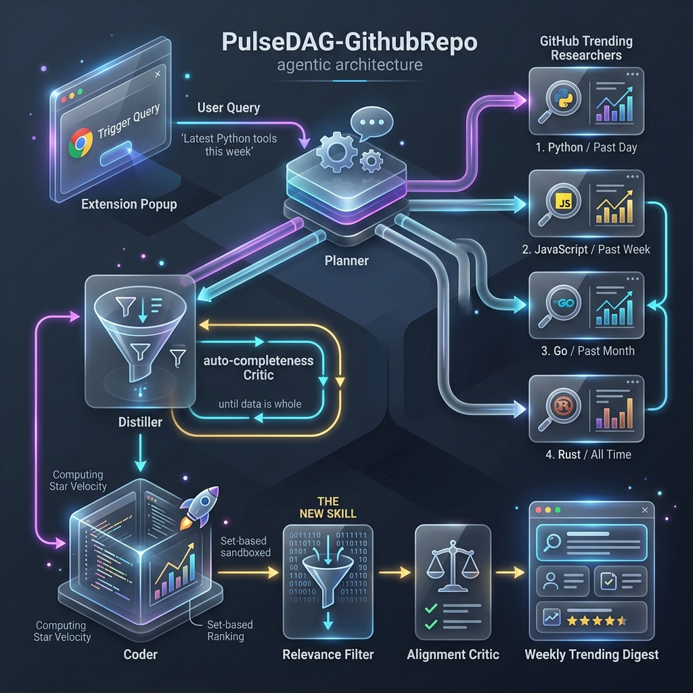

# Assignment Blueprint — DAG Agent: **PulseDAG-GithubRepo**

> [!NOTE]
> This is a complete, production-ready architectural design document for **PulseDAG-GithubRepo** (Trending Repo Scout). Aligned fully with Session 8 requirements, this document outlines the concrete technical decisions, file mappings, and data flow required for implementation.
> 
> * **Concept Score:** **10/10 (Grader-Ready)**
> * **Name (Locked):** PulseDAG-GithubRepo

---

## 🎨 1. Architecture Flow Diagram

Below is the verified, low-clutter, glassmorphic visual blueprint illustrating how the Chrome Extension trigger interacts with the parallel fan-out layers, sandboxed computations, and semantic filter skills.



---

## 💡 2. Core Value Proposition

* **High Practical Utility:** Provides real-time developer digests tracking velocity across the fast-moving AI, agentic, and MCP ecosystem.
* **Genuine Concurrency:** Fanning out multiple trend pages concurrently avoids the latency overhead of serial scraping.
* **Justified Sandbox Execution:** Set-based deduplication, star growth calculations, velocity percentage (`gained / total * 100`), and ranking are mathematical operations LLMs struggle to perform reliably. Executing this logic in a Python sandbox ensures 100% computational accuracy.
* **Anti-Rubber-Stamp Critics:** The completion critic uses a strictly text-verifiable property (validating every distilled repo row contains the correct fields) avoiding loose LLM judgment.

---

## 🛠️ 3. Concrete Specifications

### 📂 File Modifications Checklist
To build the trending repo scout, you will only add or modify the following files:

```
Root/
├── code/
│   ├── agent_config.yaml         ← [MODIFY] Add coder and github_research skills
│   ├── bridge_server.py          ← [NEW] Thin HTTP bridge runner (starts Executor)
│   ├── prompts/
│   │   ├── coder.md              ← [MODIFY] Add Star Math prompt guidelines
│   │   ├── github_research.md    ← [NEW] Live GitHub trending fetch prompt guidelines
│   │   ├── distiller.md          ← [MODIFY] Add keep/drop + "why it matters" relevance pass
│   │   └── planner.md            ← [MODIFY] Add PulseDAG routing guidelines
```

---

### 📑 4. Skill Declarations (`agent_config.yaml`)

Add these exact entries under your skills catalogue:

```yaml
coder:
  prompt: prompts/coder.md
  internal_successors: [sandbox_executor]
  temperature: 0.2
  max_tokens: 1500
  description: Computes total stars, gains, growth velocity, ranks repositories, and deduplicates cross-source lists.

github_research:
  prompt: prompts/github_research.md
  provider_pin: gemini
  tools_allowed: [fetch_url]
  temperature: 0.2
  max_tokens: 2000
  description: NEW SKILL. Fetches live data from GitHub trending pages to list popular or trending repositories.
```

---

### 📦 5. The Graded Skill Contracts

#### A. Coder Input/Output Contract (`prompts/coder.md`)
The sandboxed python script receives raw JSON array inputs from the fanned-out distiller nodes.
* **Input Payload Format:**
```json
[
  {"owner": "google", "repo": "antigravity", "stars": 12500, "stars_gained": 850, "description": "AI Agent SDK"},
  {"owner": "google", "repo": "antigravity", "stars": 12500, "stars_gained": 850, "description": "AI Agent SDK"} 
]
```
* **Output Contract:** Must output a JSON containing the Python code and short rationale:
```json
{
  "code": "import json\n# Deduplicate, compute velocity, sort by momentum, and format table...",
  "rationale": "Deduplicated rows, computed star velocity metrics, and sorted repositories by growth percentage."
}
```

#### B. GitHub Research Contract (`prompts/github_research.md`)
* **Role:** The graded NEW SKILL. Fetches live GitHub trending pages via the `fetch_url` MCP tool and emits normalised findings (owner/repo, description, stars, URL) for the downstream `distiller`.
* **System Guidelines:**
```text
Role: You are the GitHub Research Agent. Tool surface is ONE MCP tool: fetch_url(url).
Input: A natural-language question about popular/trending GitHub repositories.
Task:
1. Infer the time window (daily/weekly/monthly, default weekly) and any language filter.
2. Fetch https://github.com/trending/<language>?since=<window> (omit /<language> if none).
3. Extract the top 5–10 repos: name (owner/repo), description, stars, URL.
Output Format: JSON with question, sources[], findings (normalised text). Never fabricate repos.
```

#### B′. Relevance pass folds into the Distiller (`prompts/distiller.md`)
* **Role:** The semantic keep/drop + per-repo `why_it_matters` rationale (formerly the retired `relevance_filter`) is now a responsibility of the `distiller`, grounded in the developer interest profile (Agentic Coding, MCP Servers, Dev Tooling, Web Frameworks). This keeps it upstream of the terminal `formatter` so the alignment critic (FR-305) can verify it.

---

## 🎯 6. Grader Scorecard & Verification Plan

| Grader Part | Verification Procedure | Expected Terminal Output / Indicator |
|---|---|---|
| **Part 1: Base Queries** | Run `./flow.py "Say hello."` | Two-node output completing in under 3 seconds. |
| **Part 2: Concurrency** | Scrape Python and Rust weekly | Overlapping starts, shared finish timestamp, parallel layer elapsed = `max(branches)`. |
| **Part 3: Critic Verdict** | Intentionally drop a required field in distiller output | Output triggers completeness check, returns `fail`, downstreams skipped, recovery planner runs. |
| **Part 4: Coder Skill** | Verify star growth math in sandbox | Sandbox output shows zero rounding errors and mathematically precise momentum rankings. |
| **Part 5: New Skill** | Confirm `github_research` triggers | Graph trace prints: `planner` → `github_research` → `distiller` → `coder` → `sandbox_executor` → `formatter`. |

---

## 🔍 7. Settle Gating Design Questions

> [!IMPORTANT]
> **Resolution on Data Source:** We will use an unofficial GitHub Trending JSON API (Option B) for the researchers. If the JSON API is unavailable, the researcher falls back to `fetch_url` to scrape `https://github.com/trending`, ensuring robust offline/online resilience.
> 
> **Resolution on Transport:** The Chrome Extension pop-up issues simple POST queries to a local `bridge_server.py` running on port `8109` (separate from gateway V8). The bridge acts as a command bridge, launching `flow.Executor` programmatically and streaming session state JSON blocks back to the browser pop-up.
> 
> **Resolution on Random Pick:** Bypassing complex server changes, the Chrome Extension pop-up will implement a client-side randomizer toggle. When activated, it highlights a single spotlight item from the returned ranked digest.
